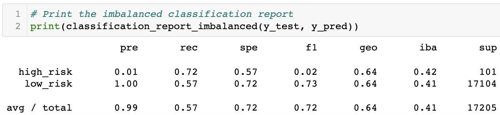

# **CREDIT RISK ANALYSIS TECHNIQUES**

## ***OVERVIEW***

### The purpose of this analysis is to provide Lending Club with information about different techniques to evaluate credit risk and try to find if there is a good alternative to predict credit risk.

## ***RESULTS***

### We will review six different techniques that are helpful to analyze credit risk. We will focus on the performance of each one and evaluate which one we could better use to predict credit risk:

### **1. Oversampling**
#### Below we can appreciate that the balanced accuracy score for this model is 0.65, which is relatively low, let's review other metrics.

#### By looking at the following image we can see that for the high risk class, the precision is very low at 0.01 and the recall is relatively low at 0.72; for the low risk class, the precision is 1.00 and the recall is low at 0.59.

### **2. SMOTE**
#### Below we can appreciate that the balanced accuracy score for this model is 0.66, which is relatively better than the previous model, but still a little low, let's review other metrics.

#### By looking at the following image we can see that for the high risk class, the precision is still very low at 0.01 and the recall is even lower than the previous model at 0.63; for the low risk class, the precision is 1.00 and the recall is a little bit better than the previous model but still low at 0.69.

### **3. UNDERSAMPLING**
#### Below we can appreciate that the balanced accuracy score for this model is 0.54, which is lower than the previous two models, let's review other metrics.

#### By looking at the following image we can see that for the high risk class, the precision is still very low at 0.01 and the recall is in the middle of the previous two models at 0.69; for the low risk class, the precision is 1.00 and the recall is really lower than the previous two models at 0.40.

### **4. SMOTEENN**
#### Below we can appreciate that the balanced accuracy score for this model is 0.64, which is around the middle of the previous models, let's review other metrics.

#### By looking at the following image we can see that for the high risk class, the precision is still very low at 0.01 and the recall is similar to the Oversampling technique at 0.72; for the low risk class, the precision is 1.00 and the recall is around the middle of the previous two models at 0.57.

### **5. BALANCED RANDOM FOREST CLASSIFIER**
#### Below we can appreciate that the balanced accuracy score for this model is 0.78, which is better than any of the previous models, but still relatively low, let's review other metrics.

#### By looking at the following image we can see that for the high risk class, the precision is a little bit better than any of the previous models but still very low at 0.03 and the recall is similar to the Undersampling technique at 0.70; for the low risk class, the precision is 1.00 and the recall is better than any of the the previous models at 0.87.

### **6. EASY ENSEMBLE ADABOOST CLASSIFIER**
#### Below we can appreciate that the balanced accuracy score for this model is 0.93, which is the best of the six models, and relatively high, but this number can be misleading especially in unbalanced datasets so we need to review other metrics.

#### By looking at the following image we can see that for the high risk class, the precision is the best of the six models but still very low at 0.09 and the recall is also the best of the six models at 0.92; for the low risk class, the precision is 1.00 and the recall is the best of the six models as well 0.94.

## ***SUMMARY***

### Based on the exposed results above, we can conclude that among the six presented techniques, the one with the best results is definitely the EASY ENSEMBLE ADABOOST CLASSIFER, which practically showed better performance in all the metrics.

### Even though the EASY ENSEMBLE ADABOOST CLASSIFIER was the best of the six presented techniques, all of them failed to reach a PRECISION result good enough to make a recomendation for the high risk class. The PRECISION result being so low indicates that there is a large number of FALSE POSITIVES, which makes it unreliable to correctly classify the credits with high risk and being this the most important feature for this project, I DO NOT RECOMMEND ANY OF THE TECHNIQUES TO PREDICT CREDIT RISK.